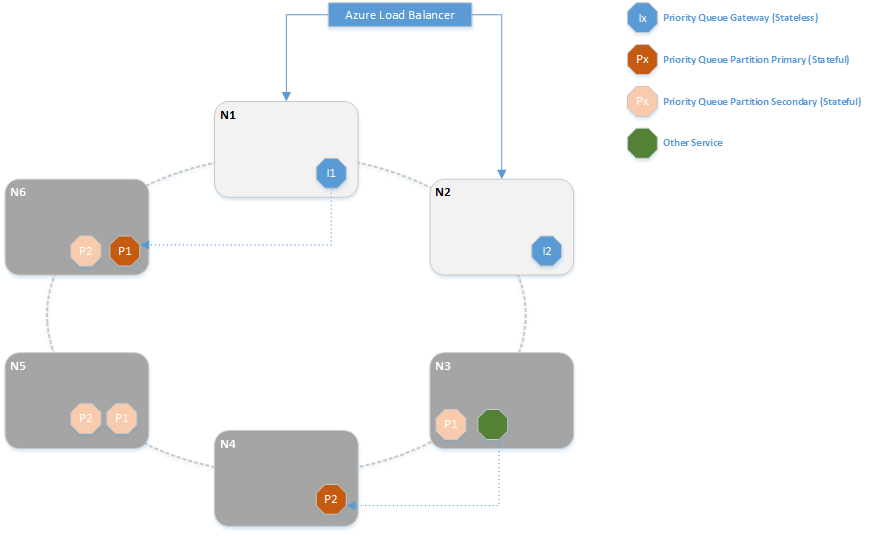

# Service Fabric .NET Priority Queue Service (0.9.0)

The Service Fabric .NET Priority Queue Service allows you to build applications that have the need for a low latency, high scale priority queue. Out of the box, this example code provides a priority queue to which items can be enqueued and dequeued within a Service Fabric cluster.  

## What is the Priority Queue Service
The Priority Queue Service is a service for storing messages that can be stored and accessed quickly within a Service Fabric cluster. The queue can be configured to have any number of partitions, each partition can contain gigabytes of messages, constrained by the size of the node. A single message is a JSON message of any size and type, the message payload is opaque to the service. The queue service supports leasing of messages, message expiration, handles poison messages and has separate dead letter storage. This is not intended meet the needs of a pub-sub service, [Azure Event Hubs](https://azure.microsoft.com/en-us/services/event-hubs/) is intended for that purpose.

## Topology
The Priority Queue Service can be deployed as part of your application within your Service Fabric Cluster. There are multiple topologies that can be supported, two are shown in the diagram below

